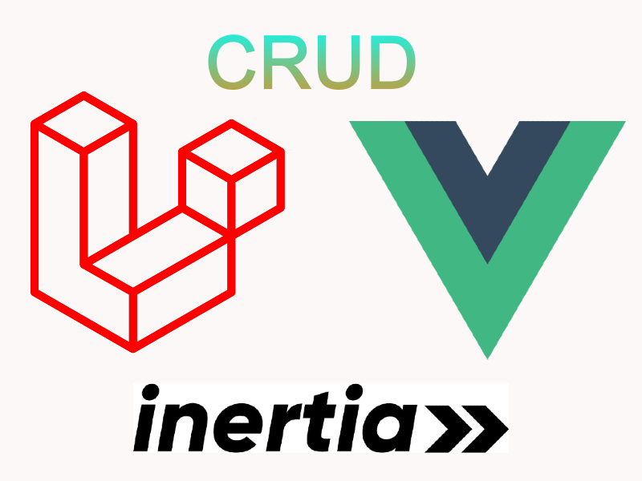
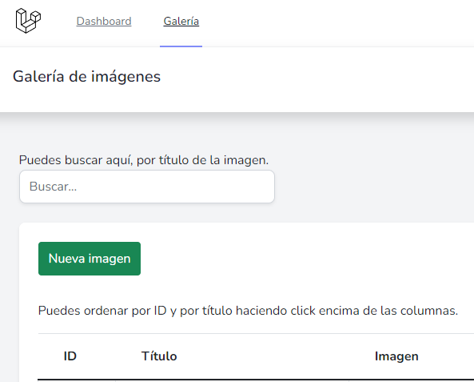
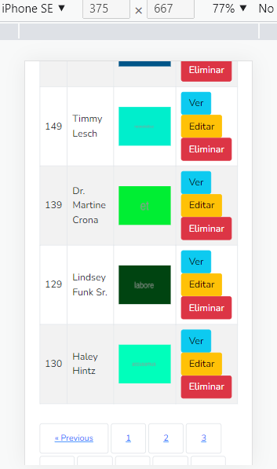

# CrudPrimeraEtapa

### Integrantes :

- David Gonzalez
- Valentin Pujiula  
- Daniel Maestre 
- Alex Gonzalez
- Gaspar Novel

--- 

**Los requerimientos de la practica los podemos encontrar en el documento PDF `ProjectInfo.pdf`**

## CRUD de galería de imágenes con Laravel 9 + Vue + Inertia.js



### Utilizar la base de datos remota

Necesitamos cambiar estas credenciales del .env y poner los valores exactamente igual que aquí:

```
DB_CONNECTION=pgsql
DB_HOST=randion.es
DB_PORT=5432
DB_DATABASE=crudgaleriafct
DB_USERNAME=dmaestre_usr
DB_PASSWORD=abc123.
```

### Respuestas a las preguntas

<b>a. ¿Qué es lo más difícil de realizar en esta prueba?</b>

En mi caso lo más difícil ha sido aprender a integrar Laravel y Vue juntos, y lo he querido hacer así ya que, aparte de mis prácticas en la empresa, tengo un proyecto de final de FP Grado Superior que voy a hacer con estas tecnologías. Programar este CRUD me ha ayudado a estar mejor preparado para afrontar ese proyecto y posiblemente también los proyectos que se me propongan durante las prácticas en empresa.<br>

También ha sido un reto implementar algunas de las tecnologías propuestas que son nuevas para nosotros, como datatables. No he podido implementar directamente la librería oficial tal y como he configurado el entorno de este proyecto, al usar Vue me ha venido mejor buscar información para aprender a programar "a mano" varias de las funcionalidades de los datatables.

El cambio de imagen en el Update también me ha dado varios problemas, espero haberlo podido arreglar por completo.

<b>b. ¿Qué es lo más fácil de realizar en esta prueba?</b>

Las operaciones básicas del CRUD.

<b>c. ¿Qué es lo que más te gusta trabajar en Laravel?</b>

Las rutas y programar la lógica de los controladores tipo resource.

<b>d. ¿Cuál es tu asignatura favorita?</b>

Desarrollo Web en Entorno Cliente, que se nos enseña en segundo curso.

<b>e. ¿Qué es lo que esperas de este proceso de aprendizaje y desarrollo?</b>

Saber trabajar y adaptarme mejor a los proyectos que se realizan en entornos "reales", proyectos que están destinados a salir a producción.

<b>Preferencias para trabajar en equipo:</b>

1. Frontend
2. Backend
3. Líder/Delegado
4. Tester
5. Base de datos


### Capturas

<p></p>
<p></p>

#### Ejecutar el proyecto en tu local:
Dentro de la carpeta de crudglrfct, ejecutar: ```php artisan serve```
Si cambias algo de Vue, compila con ```npm run watch```